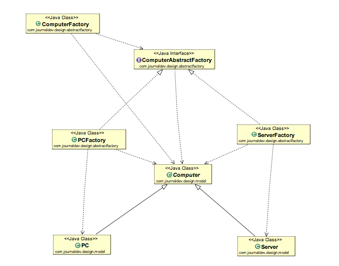

<h2> Abstract Factory Design Pattern</h2>
 

<h3>Abstract Factory pattern is almost similar to Factory Pattern except the fact that its more like factory of factories.</h3>

If you are familiar with factory design pattern in java, you will notice that we have a single Factory class. This factory class returns different subclasses based on the input provided and factory class uses if-else or switch statement to achieve this. In the Abstract Factory pattern, we get rid of if-else block and have a factory class for each sub-class. Then an Abstract Factory class that will return the sub-class based on the input factory class. At first, it seems confusing but once you see the implementation, it’s really easy to grasp and understand the minor difference between Factory and Abstract Factory pattern. Like our factory pattern post, we will use the same superclass and sub-classes.

 

 

<h3>Abstract Factory Design Pattern Benefits</h3>
 Abstract Factory design pattern provides approach to code for interface rather than implementation.
 Abstract Factory pattern is “factory of factories” and can be easily extended to accommodate more products, for example we can add another sub-class Laptop and a factory LaptopFactory.
 Abstract Factory pattern is robust and avoid conditional logic of Factory pattern.

<h3>Abstract Factory Design Pattern Examples in JDK</h3>
 - javax.xml.parsers.DocumentBuilderFactory#newInstance()
 - javax.xml.transform.TransformerFactory#newInstance()
 - javax.xml.xpath.XPathFactory#newInstance()
